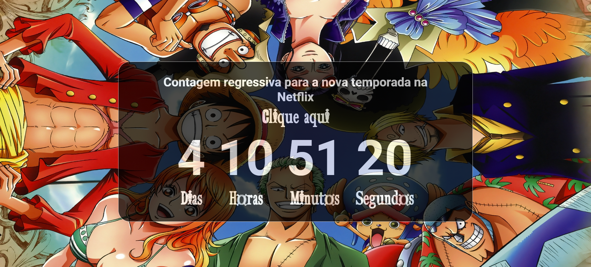

# Projeto Contador Regressivo One Piece

## Descrição
Este é um pequeno projeto JavaScript que implementa um contador regressivo para a nova temporada de One Piece na Netflix. O contador exibe a contagem regressiva em dias, horas, minutos e segundos, utilizando a função `setInterval` para atualizar os valores a cada segundo.

## Estrutura do Projeto

O projeto consiste em três arquivos principais:

1. **index.html**
   - Estrutura HTML básica com tags semânticas.
   - Inclusão de folhas de estilo e script externos.

2. **main.css**
   - Estilo simples para a página, usando a fonte personalizada "onePiece".
   - Estilo para o fundo hero e o menu de navegação.

3. **main.js**
   - Lógica JavaScript para calcular e exibir a contagem regressiva.
   - Utiliza o `setInterval` para atualizar a contagem a cada segundo.

## Como Executar
1. Faça o download ou clone este repositório.
2. Abra o arquivo `index.html` em um navegador web.

## Pré-requisitos
- Navegador web moderno que suporte JavaScript.

## Agradecimentos
- Inspirado pelo anime One Piece.

## Screenshots

## Melhorias Futuras
- Adicionar mais estilos e animações.
- Personalizar ainda mais a experiência do usuário.
